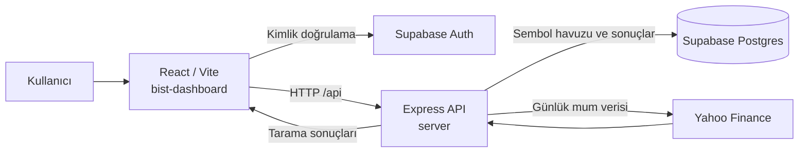

# Proje Mimarisi

Bu proje, BIST hisselerini teknik kriterlere göre tarayan iki parçalı bir web uygulamasıdır:

- `bist-dashboard/`: React tabanlı kullanıcı arayüzü
- `server/`: Express tabanlı API, tarama motoru ve Supabase erişimi

## Genel Akış



## Frontend

Ana giriş noktası `bist-dashboard/src/main.jsx`, uygulama bileşeni ise `bist-dashboard/src/App.jsx` dosyasıdır.

### Sorumluluklar

- Supabase Auth ile oturum açma, kayıt ve çıkış
- Uygulama açıldığında son tarama sonucunu ve sembol havuzunu yükleme
- Yeni tarama isteğini API'ye gönderme
- Tarama sonuçlarını tablo halinde gösterme
- Sembol ekleme ve silme işlemlerini API üzerinden yürütme

### Frontend servis katmanı

`bist-dashboard/src/services/api.js`, tüm backend çağrılarını tek noktada toplar. API adresi şu anda yerel geliştirme ortamı için `http://localhost:3001/api` olarak tanımlıdır.

| İşlem | HTTP isteği |
|---|---|
| Son tarama | `GET /latest-results` |
| Yeni tarama | `POST /scan-all` |
| Sembolleri listele | `GET /tickers` |
| Sembol ekle | `POST /tickers` |
| Sembol sil | `DELETE /tickers/:id` |

`bist-dashboard/src/supabaseClient.js` yalnızca tarayıcıdaki Auth oturumu için publishable anahtarı kullanır. Sunucu anahtarı bu katmanda yer almamalıdır.

## Backend

`server/index.js`, Express uygulamasını başlatır ve tüm uygulama API'lerini `/api` altında `server/routes/scanner.js` dosyasına yönlendirir.

### Rota katmanı

`server/routes/scanner.js` aşağıdaki görevleri üstlenir:

- `tickers` tablosundaki sembolleri yönetir.
- `scan-all` isteğinde sembol havuzunu okur.
- Taramayı en fazla beş eşzamanlı işçi ile çalıştırır.
- Tarama zamanını `scan_logs` tablosuna yazar.
- Kriteri geçen hisseleri `scan_results` tablosuna kaydeder.
- Açılışta kullanılmak üzere en güncel tarama ve sonuçlarını döndürür.

Tarama başarısız olan tekil semboller `scanOne` içinde hata sonucu olarak ele alınır; tüm tarama yalnız bu sebeple kesilmez.

### Tarama katmanı

`server/services/scanner.js` tek bir sembol için şu işlemleri yapar:

1. Yahoo Finance'ten yaklaşık son altı aylık günlük mum verisini alır.
2. Yahoo'nun `adjclose` değerini kullanarak OHLC fiyatlarını `yfinance(auto_adjust=True)` yaklaşımına uygun biçimde düzeltir.
3. ALMA(9), VWMA(21), CMF(20) ve ADX(14) hesaplar.
4. Son mum için ALMA ve VWMA yüzdesel mesafelerini hesaplar.
5. Aşağıdaki kriterlerin tamamı sağlanırsa sonucu döndürür:

   - ALMA9 mesafesi `%2` ile `%6` arasında
   - VWMA21 mesafesi `%2` ile `%6` arasında
   - Son mum yeşil: `Close > Open`

CMF ve ADX sonuç tablosunda bilgi amaçlı gösterilir; seçim kriterinin parçası değildir.

## Veri Modeli

Uygulamanın kullandığı Supabase tabloları:

| Tablo | Amaç | Temel alanlar |
|---|---|---|
| `tickers` | Taranacak sembol havuzu | `id`, `symbol` |
| `scan_logs` | Her taramanın kaydı | `id`, `scanned_at`, `user_id` |
| `scan_results` | Bir taramaya ait eşleşmeler | `scan_id`, `symbol`, `price`, `alma_dist`, `vwma_dist`, `adx`, `cmf` |

`scan_results.scan_id`, ilgili `scan_logs.id` kaydına bağlanır. Yeni tarama başlatıldığında önce log kaydı, ardından varsa sonuç kayıtları oluşturulur.

## Ortam Değişkenleri

Backend'in `server/.env` dosyasında aşağıdaki değerler bulunmalıdır:

```env
SUPABASE_URL=...
SUPABASE_SERVICE_ROLE_KEY=...
PORT=3001
```

`SUPABASE_SERVICE_ROLE_KEY` yalnızca backend'de kullanılmalıdır; frontend'e veya sürüm kontrolüne eklenmemelidir.

## Geliştirme Komutları

```bash
# Frontend
cd bist-dashboard
npm run dev

# Backend
cd server
npm run dev
```

Frontend kalite kontrolleri:

```bash
cd bist-dashboard
npm run lint
npm run build
```
